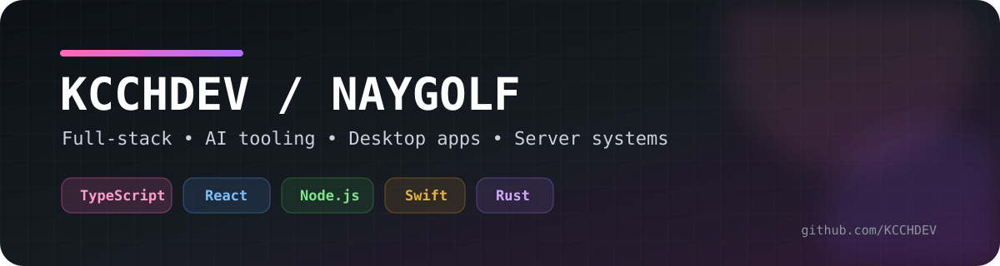

<div align="center">



# KCCHDEV / NAYGOLF

**Full-stack Developer · AI Tooling · Desktop Apps · Server Systems**

สวัสดีครับ ผมกอล์ฟ — นักพัฒนาที่ชอบทำทั้งเว็บ แอปเดสก์ท็อป ระบบเซิร์ฟเวอร์ และเครื่องมือสำหรับ AI Coding Agent

[GitHub](https://github.com/KCCHDEV) · [Linktree](https://linktr.ee/NayGolf) · [Email](mailto:golfdx34@gmail.com)

</div>

---

## 👨‍💻 เกี่ยวกับผม

- 💻 ทำงานด้าน **Full-stack Development**, **AI tooling**, **Automation** และ **Server systems**
- 🧠 สนใจการสร้าง workflow สำหรับ **Codex, Claude Code, Cursor, OpenCode, Cline และ AI Coding Agent**
- 🖥️ ทำแอป native/desktop ด้วย **SwiftUI, Tauri, React และ Rust**
- ⚙️ ใช้งานฝั่ง backend และ infrastructure เช่น **Node.js, Docker, Linux, PostgreSQL และ Nginx**
- 🌱 ชอบทดลองเทคโนโลยีใหม่และสร้างโปรเจกต์ที่เอาไปใช้งานจริงได้

## 🚀 โปรเจกต์เด่น

### 🧠 [NEY Coder AI Skill](https://github.com/KCCHDEV/coder-noey-skill)
ระบบ Skill + Workflow สำหรับ AI Coding Agent ที่เน้นการวิเคราะห์ assumption, ประเมินความเสี่ยง, วาง rollback และทำงานแบบ production-aware ก่อนลงมือ implement

### 💰 [MyMoneyFlow](https://github.com/KCCHDEV/MyMoneyFlow)
แอปจัดการรายรับรายจ่ายแบบ **local-first สำหรับ macOS** สร้างด้วย SwiftUI + Charts รองรับหลายกระเป๋า การโอนเงิน งบรายเดือน การค้นหา และการ backup/import ข้อมูล

### 🍓 [Ichigo Music](https://github.com/KCCHDEV/Ichigo-Music)
Desktop music player ที่สร้างด้วย **Tauri v2 + React + TypeScript + Rust** ใช้ Lavalink v4 เป็น audio engine และมี UI ที่ออกแบบสำหรับการใช้งานบนเดสก์ท็อป

### 🎵 [Makori Music](https://github.com/KCCHDEV/Makori-Music)
หนึ่งในโปรเจกต์เพลงที่พัฒนามาต่อเนื่องบน GitHub

---

## 🛠️ Tech Stack

### Languages
`TypeScript` · `JavaScript` · `Python` · `Swift` · `Rust` · `Go` · `Java` · `C/C++` · `C#` · `PHP`

### Frontend / Desktop
`React` · `Next.js` · `Vue` · `Tailwind CSS` · `SwiftUI` · `Tauri` · `Electron`

### Backend / Data
`Node.js` · `Express` · `NestJS` · `PostgreSQL` · `MySQL` · `MongoDB` · `SQLite` · `Firebase`

### DevOps / Tools
`Docker` · `Linux` · `Nginx` · `Git` · `GitHub` · `Bash` · `Postman`

### AI Coding / Automation
`Codex` · `Claude Code` · `Cursor` · `OpenCode` · `Cline` · `Roo Code` · `Windsurf`

---

## 📌 Current Focus

```text
AI Coding Agent workflows
Desktop applications
Full-stack web systems
Server & infrastructure automation
Developer tooling
```

## 🌐 ติดต่อ

- GitHub: [@KCCHDEV](https://github.com/KCCHDEV)
- Linktree: [NayGolf](https://linktr.ee/NayGolf)
- Email: [golfdx34@gmail.com](mailto:golfdx34@gmail.com)

---

<div align="center">

### Thanks for visiting 👋

`Build · Learn · Improve · Repeat`

</div>
